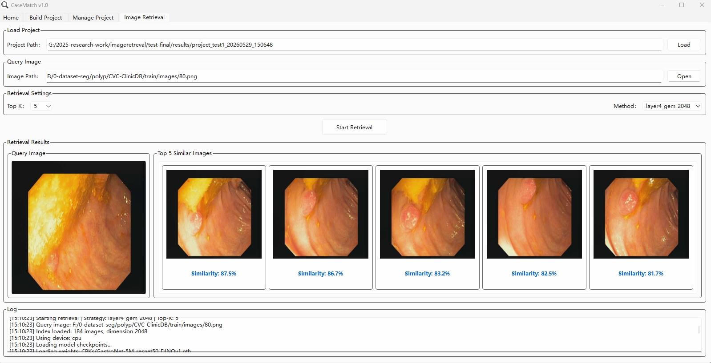

# CaseMatch, An open-source content-based image retrieval (CBIR) tool for medical imaging

**An open-source content-based image retrieval (CBIR) tool for medical imaging**

CaseMatch is a fully open-source, no-code medical image retrieval software built on PySide and vector indexing. It enables clinicians and researchers to rapidly construct, maintain, and query large-scale medical image repositories without any programming background.

CaseMatch_V1_0_0_User_Guide.pdf can be found in user_guide folder

## 🚀 Key Features

- **No-code image library construction**: Build searchable vector databases from local image folders with a single click
- **Incremental index maintenance**: Automatically detect and update newly added or modified images without full reconstruction
- **Multi-strategy feature extraction**: Compare and switch between four pretrained ResNet50 backbones in real time:
  - ImageNet supervised
  - DINO self-supervised
  - Endoscopy domain-specific (GastroNet-5M)
  - Pathology domain-specific (RetCCL)
- **Dual pooling strategies**: Global average pooling (AvgPool) vs. local discriminative embedding (Layer4+GeM)
- **Visualization support**: Grad-CAM / CAM heatmaps to highlight similar anatomical or lesion regions
- **Offline deployment**: Ready-to-run Windows executable (.exe) available alongside full source code

## Software Page

## 📊 Performance Highlights

| Modality | Dataset | Images | Classes | Best Top-1 Accuracy |
|:---|:---|:---|:---|:---|
| Dermoscopy | HAM10000 | 10,015 | 7 | 77.23% |
| Endoscopy | Kvasir-v2 | 8,000 | 8 | **87.50%** (GastroNet-5M) |
| Histopathology | NCT-100K | 100,000 | 9 | **99.17%** (RetCCL) |

&gt; Domain-specific self-supervised pretraining consistently outperforms ImageNet pretraining and task-specific fine-tuning in medical image retrieval, highlighting the critical value of domain-aligned representation learning.

## 🖥️ System Requirements

- **OS**: Windows 10/11 (executable) or Linux/macOS (source code)
- **Python**: 3.8+
- **GPU**: Optional (CPU inference supported)

## Cache and Results

- The software stores cache in the `cache` folder.
- The results of the software are saved in the `results` folder.

## Executable Files

Pyinstaller is recommended for packaging Python applications into standalone executable files.

### CPU Version

- **Google Drive**: [CaseMatch-CPU.zip](https://drive.google.com/file/d/1LVEbkhDWLO7bnf_FKzxAdBeGU_UprQXg/view?usp=drive_link)
- **Baidu Cloud Disk**: [CaseMatch-CPU.zip](https://pan.baidu.com/s/1M1woUx89gpuRugnNT82OKg) (Extraction Code: urjg)

### GPU Version

- **Google Drive**: [CaseMatch-GPU.zip](https://drive.google.com/file/d/1rE9JDGLW4ZzdM8bqCyZp_DcFt1v4k0cy/view?usp=drive_link)
- **Baidu Cloud Disk**: [CaseMatch-GPU.zip](https://pan.baidu.com/s/1U7RiofvaGwWR88x2GYxIHA) (Extraction Code: ym89)

These executable files have integrated the required PyTorch versions, so they can be run directly without additional setup.

## Datasets

Kvasir-V2:
https://www.kaggle.com/datasets/plhalvorsen/kvasir-v2-a-gastrointestinal-tract-dataset
HAM10000:
https://www.kaggle.com/datasets/kmader/skin-cancer-mnist-ham10000
NCT-CRC-HE-100K:
https://www.kaggle.com/datasets/kmader/skin-cancer-mnist-ham10000

## Rebuild the Software

use pyinstaller to build the exe Software

