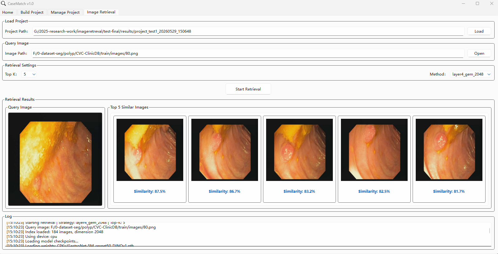

# CaseMatch

An open-source, zero-code content-based image retrieval (CBIR) tool for medical imaging.

## Description

CaseMatch is a fully open-source, no-code medical image retrieval software built on PySide6 and vector indexing. It packages multi-strategy deep feature extraction, incremental vector indexing, and Grad-CAM visualization into a standalone graphical user interface (GUI) deployable on CPU-only workstations without programming environments. The tool enables clinicians and researchers to rapidly construct, maintain, and query large-scale medical image repositories, while supporting real-time horizontal comparison across different pretrained feature extractors.

Key features include:
- **No-code image library construction**: Build searchable vector databases from local image folders with a single click.
- **Incremental index maintenance**: Automatically detect and update newly added or modified images without full reconstruction.
- **Multi-strategy feature extraction**: Compare and switch between four pretrained ResNet50 backbones in real time:
  - ImageNet supervised
  - DINO self-supervised
  - Endoscopy domain-specific (GastroNet-5M)
  - Histopathology domain-specific (RetCCL)
- **Dual pooling strategies**: Global average pooling (AvgPool) vs. local discriminative embedding (Layer4+GeM).
- **Visualization support**: Grad-CAM / CAM heatmaps to highlight similar anatomical or lesion regions.
- **Offline deployment**: Ready-to-run Windows executable (.exe) available alongside full source code.

## Dataset Information

CaseMatch accepts standard medical image formats (JPEG, PNG, BMP, TIFF) organized in folder-based collections. The software was validated on three publicly available datasets:

| Dataset | Modality | Images | Classes | Source |
|:---|:---|:---|:---|:---|
| HAM10000 | Dermoscopy | 10,015 | 7 | [DOI: 10.1038/sdata.2018.161](https://doi.org/10.1038/sdata.2018.161) / [Kaggle](https://www.kaggle.com/datasets/kmader/skin-cancer-mnist-ham10000) |
| Kvasir-v2 | Endoscopy | 8,000 | 8 | [DOI: 10.1145/3083187.3083212](https://doi.org/10.1145/3083187.3083212) / [Kaggle](https://www.kaggle.com/datasets/plhalvorsen/kvasir-v2-a-gastrointestinal-tract-dataset) |
| NCT-CRC-HE-100K (NCT-100K) | Histopathology (H&E) | 100,000 | 9 | [DOI: 10.5281/zenodo.1214456](https://doi.org/10.5281/zenodo.1214456) |

All three datasets are released under open-access terms permitting academic use. Users can substitute their own local image collections in any of the supported modalities.

CaseMatch_V1_0_0_User_Guide.pdf can be found in user_guide folder

## 🚀 Key Features

- **No-code image library construction**: Build searchable vector databases from local image folders with a single click
- **Incremental index maintenance**: Automatically detect and update newly added or modified images without full reconstruction
- **Multi-strategy feature extraction**: Compare and switch between four pretrained ResNet50 backbones in real time:
  - ImageNet supervised
  - DINO self-supervised
  - Endoscopy domain-specific (GastroNet-5M)
  - Pathology domain-specific (RetCCL)
- **Dual pooling strategies**: Global average pooling (AvgPool) vs. local discriminative embedding (Layer4+GeM)
- **Visualization support**: Grad-CAM / CAM heatmaps to highlight similar anatomical or lesion regions
- **Offline deployment**: Ready-to-run Windows executable (.exe) available alongside full source code

## Software Page

## 📊 Performance Highlights

| Modality | Dataset | Images | Classes | Best Top-1 Accuracy |
|:---|:---|:---|:---|:---|
| Dermoscopy | HAM10000 | 10,015 | 7 | 77.23% |
| Endoscopy | Kvasir-v2 | 8,000 | 8 | **87.50%** (GastroNet-5M) |
| Histopathology | NCT-100K | 100,000 | 9 | **99.17%** (RetCCL) |

&gt; Domain-specific self-supervised pretraining consistently outperforms ImageNet pretraining and task-specific fine-tuning in medical image retrieval, highlighting the critical value of domain-aligned representation learning.

## 🖥️ System Requirements

- **OS**: Windows 10/11 (executable) or Linux/macOS (source code)
- **Python**: 3.8+
- **GPU**: Optional (CPU inference supported)

## Cache and Results

- The software stores cache in the `cache` folder.
- The results of the software are saved in the `results` folder.

##  Code Information

### Code Structure

CaseMatch/  
├── main.py                     # Application entry point  
├── build_project_worker.py     # Core logic for index construction and feature extraction  
├── manage_project_worker.py    # Core logic for incremental index maintenance  
├── retrieval_worker.py         # Core logic for content-based image retrieval  
├── build_gui.py                # GUI interaction layer for index construction  
├── manage_gui.py               # GUI interaction layer for index maintenance  
├── retrieval_gui.py            # GUI interaction layer for retrieval and visualization  
├── CPKs/                       # Pretrained model checkpoints  
├── UI/                         # Original UI layout files  
├── requirements.txt            # requirement file 
├── models/                     # ResNet backbone implementations (PyTorch)  
└── user_guide/                 # User guide documentation (PDF)

### Executable Files

Pyinstaller is recommended for packaging Python applications into standalone executable files.

### CPU Version

- **Google Drive**: [CaseMatch-CPU.zip](https://drive.google.com/file/d/1XbSzdqNmmHq6-VaY-QauspS313LdVr8m/view?usp=drive_link)
- **Baidu Cloud Disk**: [CaseMatch-CPU.zip](https://pan.baidu.com/s/1z1vB8896zcNSd4Agnq_0UQ?pwd=7t6g) (Extraction Code: 7t6g)

### GPU Version

- **Google Drive**: [CaseMatch-GPU.zip](https://drive.google.com/file/d/1_OEoHSsX1PFo1utH4mtEOHZtKKGcIcHJ/view?usp=sharing)
- **Baidu Cloud Disk**: [CaseMatch-GPU.zip](https://pan.baidu.com/s/1wZeAVNrbtmY887I3TP63HQ?pwd=zv1f) (Extraction Code: zv1f)

These executable files have integrated the required PyTorch versions, so they can be run directly without additional setup.

## Rebuild the Software

use pyinstaller to build the exe Software

## License & Contribution Guidelines

This project is released under the **Apache 2.0** license.

- **Author**: All code and documentation were developed by Weihao Gao.
- **Contact**: weihaomeva@163.com
- **Issues & Bugs**: Please use the GitHub Issues tab to report bugs or request features.
- **Contributions**: Pull requests are welcome. For major changes, please open an issue first to discuss your proposal.
- **Code of Conduct**: Be respectful and constructive in all interactions.

## Citations

If you use CaseMatch in your research, please refer to:

> Gao, W. (2026). Content-based medical image retrieval with multi-strategy pretrained feature extractors: an open-source tool for clinical case comparison. *Manuscript under review*.

Source code and pre-built executables are available at:  
https://github.com/AI-thpremed/CaseMatch
